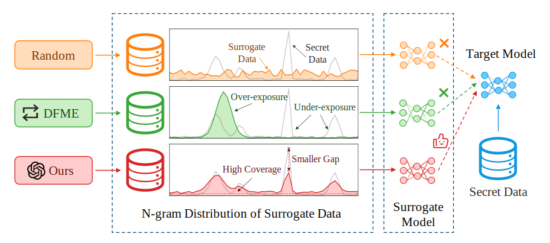
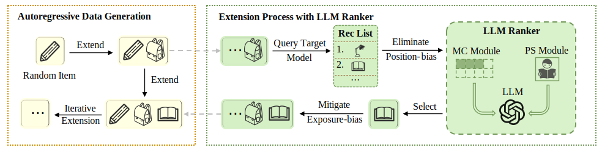

# LLM4MEA: Black box Model Extraction Attacks on Sequential Recommenders via Large Language Models

This work aims to improve model extraction attacks (MEAs) on sequential recommender systems by generating more realistic synthetic data with Large Language Models (LLMs). 

Black-box attacks in prior Model Extraction Attacks (MEAs) are ineffective at exposing recommender system vulnerabilities due to random sampling in data selection, which leads to misaligned synthetic and real-world distributions. 



Different methods (Random, [DFME](https://github.com/Yueeeeeeee/RecSys-Extraction-Attack) and Ours) generate surrogate data with varying distributions. Compared to secret data, Random data lacks specific patterns, while DFME suffers from over/under-exposure. 



To overcome this limitation, we propose LLM4MEA, a novel model extraction method that leverages Large Language Models (LLMs) as human-like rankers to generate data. 
It generates data with high coverage and a smaller gap through interactions between the LLM ranker and target recommender system.

## Requirements

PyTorch, pandas, wget, libarchive-c, faiss-cpu, tqdm, tensorboard. For our running environment see requirements.txt


## Train Black-Box Recommender Models

```bash
python train.py
```
Excecute the above command (with arguments) to train a black-box model, select datasets from Beauty, Games, Steam. Availabel models are NARM, SASRec and BERT4Rec. Trained black-box recommenders could be found under ./experiments/model-code/dataset-code/models/best_acc_model.pth


## Extract trained Black-Box Recommender Models

```bash
python distill.py
```
Excecute the above command (with arguments) to extract a white-box model, white-box model can also be chosen from NARM, SASRec and BERT4Rec. Trained models could be found under ./experiments/distillation_rank/distillation-specification/dataset-code/models/best_acc_model.pth


## Acknowledgements
Our code is based on [DFME](https://github.com/Yueeeeeeee/RecSys-Extraction-Attack), thanks for the great work.
