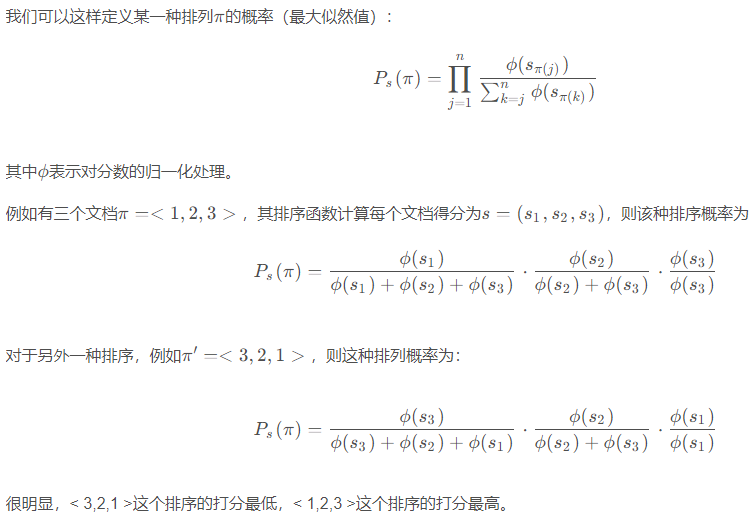

# Introduction

Fork from https://github.com/Yueeeeeeee/RecSys-Extraction-Attack


## Requirements

PyTorch, pandas, wget, libarchive-c, faiss-cpu, tqdm, tensorboard. For our running environment see requirements.txt


## Train Black-Box Recommender Models

```bash
python train.py
```
Excecute the above command (with arguments) to train a black-box model, select datasets from Movielens 1M/20M, Beauty, Games, Steam and Yoochoose. Availabel models are NARM, SASRec and BERT4Rec. Trained black-box recommenders could be found under ./experiments/model-code/dataset-code/models/best_acc_model.pth


## Extract trained Black-Box Recommender Models

```bash
python distill.py
```
Excecute the above command (with arguments) to extract a white-box model, white-box model can also be chosen from NARM, SASRec and BERT4Rec. Trained models could be found under ./experiments/distillation_rank/distillation-specification/dataset-code/models/best_acc_model.pth


## Attack trained Black-Box Recommender Models

```bash
python attack.py
```
Run the above command (with arguments) to perform profile pollution attacks, logs will be save under ./experiments/attack_rank/distillation-specification/dataset-code/attack_bb_metrics.json


## Poison trained Black-Box Recommender Models

```bash
python retrain.py
```
Run the above command (with arguments) to perform data poisoning attacks, retrained model and logs will be save under ./experiments/retrained/distillation-specification/dataset-code/

## Code notes

seqs, candidates, labels = batch

1. seqs: 某个用户的浏览序列

2. candidates: test data 与负采样拼接

3. labels: 与candidates shape相同，test data为1，负采样为0

## 改进方向

|       | 阶段              | 模型          | 改进                                                         | 结果                                                         |
| ----- | ----------------- | ------------- | ------------------------------------------------------------ | ------------------------------------------------------------ |
| **1** | **distill**       | **bert2bert** | **-**                                                        | 0.7946 (NDCG@10)                                             |
| 1.1   | distill           | bert2bert     | $loss_1$                                                     | 与1对比，收敛速度相同，性能更好(?)：0.8126 (NDCG@10)         |
| 1.2   | distill           | bert2bert     | $r^{-1}$权重赋给bb模型输出，List-wise loss，没有用到wb输出的Score |                                                              |
| 1.2.1 | distill           | bert2bert     | 使用到wb的输出计算bb模型输出序列的List-wise loss，Maximize   |                                                              |
| 1.3   | distill           | bert2bert     | $r^{-1}$NDCG权重赋给bb模型输出，kl-div                       |                                                              |
| **2** | **distill**       | **narm2narm** | **$loss_1$**                                                 |                                                              |
| 2.1   | distill           | narm2narm     | List-wise loss                                               |                                                              |
| **3** | **attack**        | **bert**      | **-**                                                        | 对本身就popular的item：R10_before[0.67,0.32,0.37], R10_after[1,1,0.99] （所有User还是光自己？） |
| 3.1   | attack            | bert          | C&W                                                          | ？                                                           |
| **4** | **attack_poison** | **bert**      | **-**                                                        |                                                              |
| 4.1   | attack_poison     | bert          | C&W                                                          | ？                                                           |

$loss_1=\frac{1}{k-1}\sum_{i=1}^{k-p}max(0,\hat{S}^k_{w[i+p]}-\hat{S}^k_{w[i]}+\lambda_1)+\frac{1}{k}\sum_{i=1}^{k}max(0,\hat{S}^k_{neg[i]}-\hat{S}^k_{w[i]}+\lambda_2),p=randint(1,(k + 1)//2)$

Learning to Rank: From Pairwise Approach to Listwise Approach

