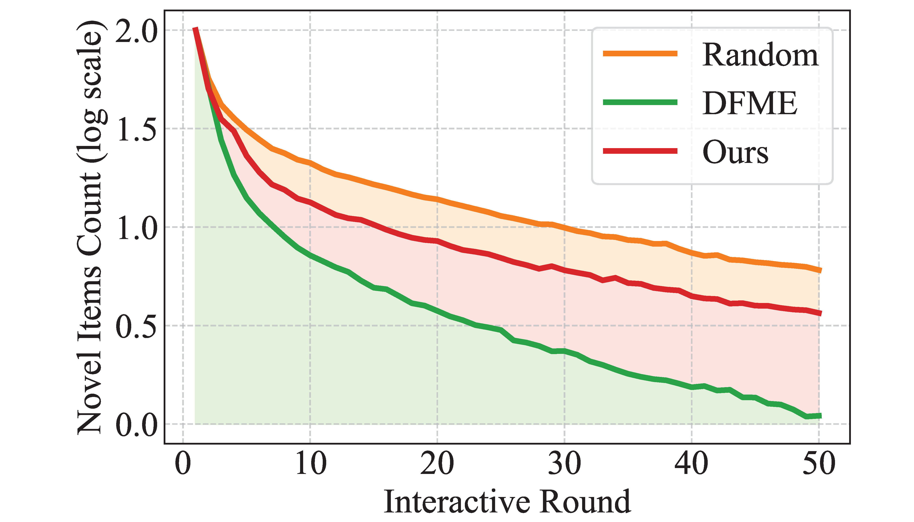
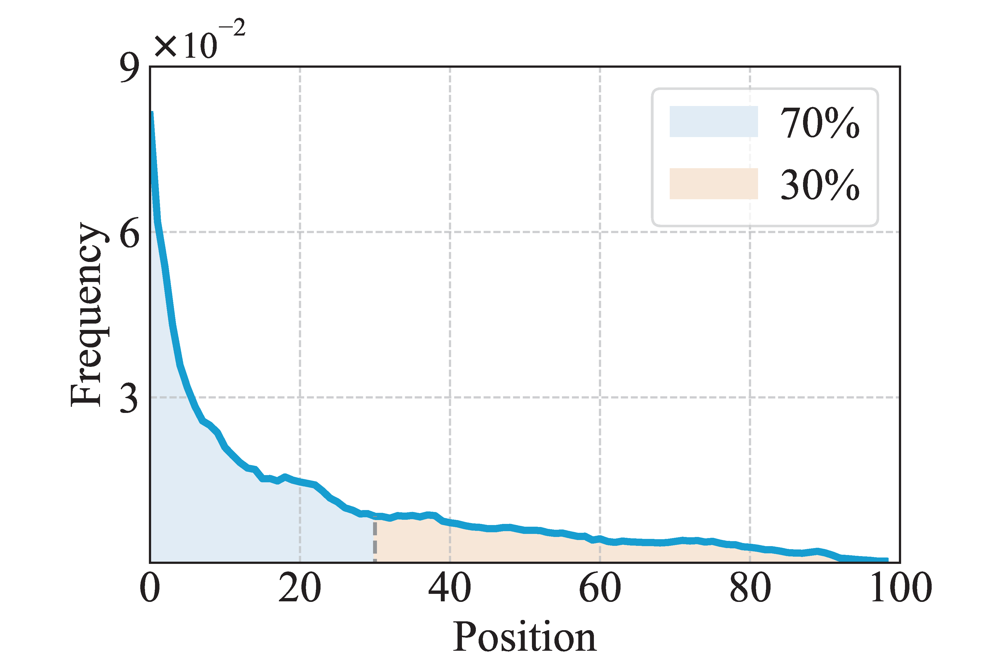
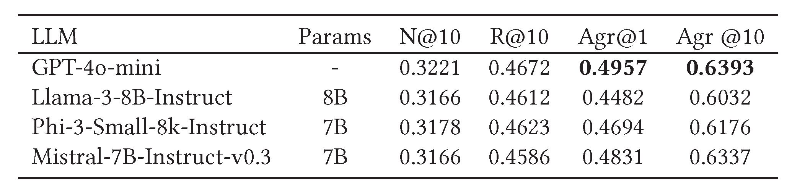
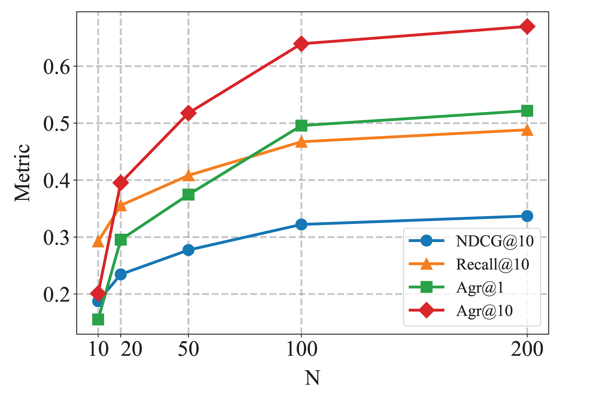

# LLM4MEA: Black box Model Extraction Attacks on Sequential Recommenders via Large Language Models
<div align="center">
<a href='https://arxiv.org/abs/XXXXX'></a> &nbsp;&nbsp;&nbsp;&nbsp;&nbsp;
 <a href='https://github.com/buaacyw/GaussianEditor/blob/master/LICENSE.txt'></a> &nbsp;&nbsp;&nbsp;&nbsp;&nbsp;
 <a href="https://twitter.com/XXXX"></a> &nbsp;&nbsp;&nbsp;&nbsp;&nbsp;
</div>

## 🔆 Introduction
This work aims to improve model extraction attacks (MEAs) on sequential recommender systems by generating more realistic synthetic data with Large Language Models (LLMs). 

Black-box attacks in prior Model Extraction Attacks (MEAs) are ineffective at exposing recommender system vulnerabilities due to random sampling in data selection, which leads to misaligned synthetic and real-world distributions. 

<p align="center"></p>

Different methods (Random, [DFME](https://github.com/Yueeeeeeee/RecSys-Extraction-Attack) and Ours) generate surrogate data with varying distributions. Compared to secret data, Random data lacks specific patterns, while DFME suffers from over/under-exposure. 

<p align="center"></p>

To overcome this limitation, we propose LLM4MEA, a novel model extraction method that leverages Large Language Models (LLMs) as human-like rankers to generate data. 
It generates data with high coverage and a smaller gap through interactions between the LLM ranker and target recommender system.

## 🚀 Quick Start
### Requirements

PyTorch, pandas, wget, libarchive-c, faiss-cpu, tqdm, tensorboard. For our running environment see requirements.txt


### Train Black-Box Recommender Models

```bash
python train.py
```
Excecute the above command (with arguments) to train a black-box model, select datasets from Beauty, Games, Steam. Availabel models are NARM, SASRec and BERT4Rec. Trained black-box recommenders could be found under ./experiments/model-code/dataset-code/models/best_acc_model.pth


### Extract trained Black-Box Recommender Models

```bash
python distill.py
```
Excecute the above command (with arguments) to extract a white-box model, white-box model can also be chosen from NARM, SASRec and BERT4Rec. Trained models could be found under ./experiments/distillation_rank/distillation-specification/dataset-code/models/best_acc_model.pth

## 📊 Experiments and Results

### RQ1: How well does LLM4MEA perform in model extraction?

<p align="center"></p>

With identical architecture, our method with debiasing outperforms DFME by 51.90% in Agreement@1 and 37.74% in Agreement@10, and surpasses Random by 22.24% and 10.99% in the data-free setting. In the data-limited setting, it shows consistent improvements, with 7.03% higher Agreement@1 and 7.36% higher Agreement@10 compared to DFME. While achieving the best performance on Steam, it performs sub-optimally on Beauty due to sparse user interactions and weak sequential patterns, which was confirmed by shuffling input sequences to remove sequential information.

<p align="center"></p>

We investigate how MEA performs when the surrogate model architecture differs from the target model. The horizontal and vertical axes denote surrogate and target architectures, respectively. MEA achieves optimal performance when the surrogate architecture matches the target architecture, with performance degrading for mismatched architectures. This finding emphasizes the importance of architecture confidentiality in protecting model privacy. Additionally, MEA demonstrates superior performance on dense datasets (Steam) compared to sparse ones.

### RQ2: Does our method generate more realistic data compared to existing methods?

<p align="center"></p>

We evaluate data divergence by measuring the N-gram Div metric (\(N=1,2\)) between surrogate and secret datasets across different datasets and architectures, using 5k sequences per experiment. A lower N-gram Div indicates smaller divergence and higher data authenticity.  

Our method significantly reduces divergence from real data patterns: compared to DFME, it achieves 64.98% and 4.74% lower uni-gram and bi-gram divergence on average, respectively; compared to random sampling, it shows 10.67% and 16.27% lower divergence. Notably, on Beauty with BERT4Rec, our method has slightly higher uni-gram divergence than Random but lower bi-gram divergence, suggesting better sequential pattern capture.  

Additionally, the relative ranking of data generation methods remains consistent across different target model architectures, indicating that the effectiveness of data generation is primarily influenced by the dataset rather than model architecture.


### RQ3: How does exposure bias and position bias affect the data generation process?

#### Exposure Bias

<p align="center"></p>

We empirically demonstrate the exposure bias in the data generation process using the Beauty dataset with the NARM architecture. We track the number of novel items that have never been recommended as interactions progress. The results show that the number of novel items decreases rapidly due to exposure bias, with DFME suffering the most severe bias, almost no novel items appear after 50 rounds. Our method mitigates this issue, exposing more novel items. 

Comparing Ours-eBias and Ours, we observe significant improvements in the data-free setting, with Agreement@1 and Agreement@10 increasing by 38.49% and 26.56%, respectively. However, a slight decrease is noted when attacking BERT4Rec trained on the Games dataset. In the data-limited setting, the improvements are more modest (3.23% and 5.53%), as the secret data is less influenced by exposure bias. This indicates that debiasing may partially offset the advantages of using secret data.

#### Position Bias

<p align="center"></p>

We analyze the position bias of the LLM ranker by presenting 100 independent items from the Beauty dataset and tracking the selection frequency across different positions. The results reveal a long-tail distribution, with 70% of the items selected from the first 30 positions, indicating a strong position bias. 

By comparing Ours-pBias and Ours, we observe that avoiding position bias improves MEA's data-free performance by 5.03% and 4.09% in Agreement@1 and Agreement@10, respectively. However, there is minimal change when attacking BERT4Rec trained on the Steam dataset. In the data-limited setting, avoiding position bias does not improve performance, as the secret data is not affected by the position bias introduced by the LLM ranker in the autoregressive framework.

### RQ4: What other factors influence MEA performance?

#### Different LLM

<p align="center"></p>

We investigated the impact of different LLMs (GPT-4o-mini, Llama-3-8B-Instruct, Phi-3-Small-8k-Instruct, and Mistral-7B-Instruct-v0.3) on data generation and MEA using identical architecture (NARM) and the Beauty dataset. While GPT-4o-mini achieved the best performance, the performance gap among different LLMs was relatively small. GPT-4o-mini achieved the highest Agreement@1 (0.4957) and Agreement@10 (0.6393), while the other LLMs showed comparable but slightly lower results.

#### The Length of Recommendation List

<p align="center"></p>

We conducted experiments on the Beauty dataset with the NARM architecture, varying the recommendation list length \(n\) from 10 to 200. The results show that both the surrogate model's performance and its consistency with the target model improve as \(n\) increases. This indicates that longer recommendation lists expose more information, making the target model more vulnerable to MEA. Limiting the list length could serve as a practical defense against MEA, as users rarely browse through 100 or 200 items at once.

## 👍 Acknowledgements
Our code is based on [DFME](https://github.com/Yueeeeeeee/RecSys-Extraction-Attack), thanks for the great work.
