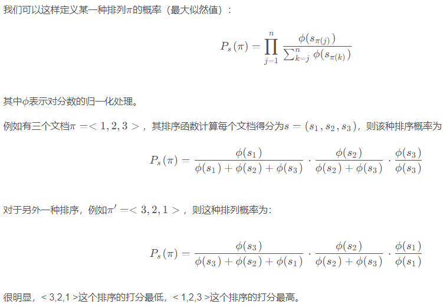

|       | 阶段          | 模型      | 改进                                                         | 结果                                                         |
| ----- | ------------- | --------- | ------------------------------------------------------------ | ------------------------------------------------------------ |
| 1     | distill       | bert2bert | -                                                            | 0.7946 (NDCG@10)                                             |
| 1.1   | distill       | bert2bert | $loss_1$                                                     | 与1对比，收敛速度相同，性能更好(?)：0.8126 (NDCG@10)         |
| 1.2   | distill       | bert2bert | $r^{-1}$权重赋给bb模型输出，List-wise loss，没有用到wb输出的Score |                                                              |
| 1.2.1 | distill       | bert2bert | 使用到wb的输出计算bb模型输出序列的List-wise loss，Maximize   |                                                              |
| 1.3   | distill       | bert2bert | $r^{-1}$NDCG权重赋给bb模型输出，kl-div                       |                                                              |
| 2     | distill       | narm2narm | $loss_1$                                                     |                                                              |
| 2.1   | distill       | narm2narm | List-wise loss                                               |                                                              |
| 4     | attack        | bert      | -                                                            | 对本身就popular的item：R10_before[0.67,0.32,0.37], R10_after[1,1,0.99] （所有User还是光自己？） |
| 4.1   | attack        | bert      | C&W                                                          | ？                                                           |
| 5     | attack_poison | bert      | -                                                            |                                                              |
| 5.1   | attack_poison | bert      | C&W                                                          | ？                                                           |

$loss_1=\frac{1}{k-1}\sum_{i=1}^{k-p-1}max(0,\hat{S}^k_{w[i+p]}-\hat{S}^k_{w[i]}+\lambda_1)+\frac{1}{k}\sum_{i=1}^{k}max(0,\hat{S}^k_{neg[i]}-\hat{S}^k_{w[i]}+\lambda_2),p=randint(1,(k + 1)//2)$

Learning to Rank: From Pairwise Approach to Listwise Approach

